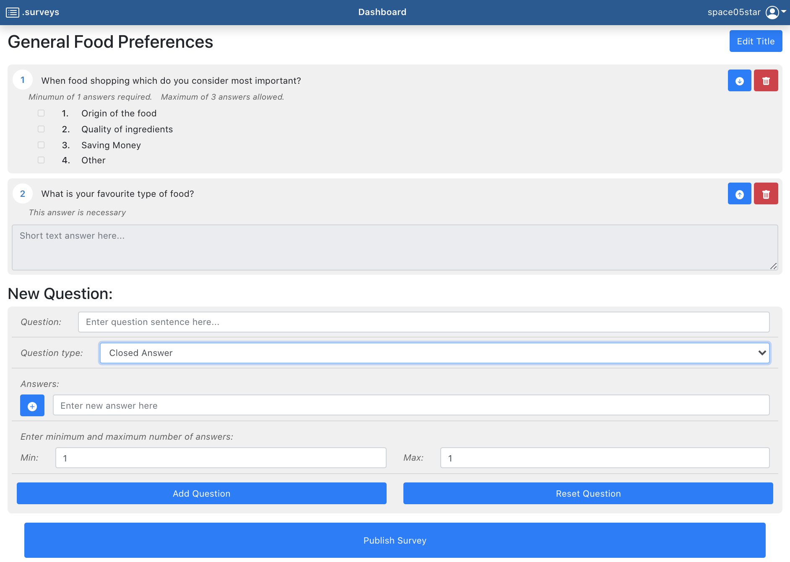

<div align="center"><h1>Surveys</h1>
	<div align="center"><p><i>Surveys web application created with React and Node.js</i></p></div>
<div align="center">


	</div>
</div>

<br>

## Getting started
To get started, just set up the <b>back-end server</b> (<i>Express.js</i>) and <b>front-end server</b> (<i>React.js</i>) of the app.
### Server
* From the server root folder, run:
```
server % npm install
```
* Once all packages are downloaded, run:
```
server % npm start
```
The server is now running ready to be contacted by the client.
<br>
### Client
* From the client root folder, run:
```
client % npm install
```
* Once all packages are downloaded, run:
```
client % npm start
```
Now you are ready to connect to the front-end server, open the browser and type in the URL of the machine running the client.

<br>

## Routes:

*  **/**, **/home**: Homepage of the website, visibile only for unlogged users. Contains a list of published surveys.<br/> If the user is logged and browse this page it is redirect to his personal 'dashboard'.

  

*  **/survey/:id**: Survey form for the survey specified by the id.

  

*  **/dashboard**: Personal 'home' for each administrator.<br/> This page allows admin to navigate to the 'editor' and shows all the surveys published by the admin and their results. Requires login.

*  **/editor**: Editor for a new survey. Allows an admin to create a new survey. Requires login.

  

*  **/results/:idCS**: Allows an admin to display the result for a specific 'CompletedSurvey', idCS is the identifier of a survey completed by a user.<br/>Navigation throught survey can be achieved by moving forward and backward in the responses made by the users. Requires login.

  

*  **/login**: Application login. Requires unlogged session. Redirect to 'home' if user is logged.

  

*  **default route**: Wrong page. Contains a link to the 'home' page.

<br>
<br>

## APIs

### getSurveys

<b>URL:</b> `/api/surveys`

  

<b>Method:</b> GET

  

<b>Description:</b> Get all the basic informations for the surveys to be displayed in the 'home' page.

  

<b>Request body:</b> _None_

  

<b>Responses:</b>

*  `200 OK` (success)

*  `500 Internal Server Error` (generic error).

  

<b>Response body:</b> An array of objects, each one describing a survey.

```
[
   {
      "id":1,
      "title":"Best place for summer vacation 2021",
      "idAdmin":1
   },
   {
      "id":2,
      "title":"Are you a psychopath?",
      "idAdmin":2
   },
   ...
]
```

<br>  

### getAdminSurvey

<b>URL:</b> `/api/adminsurveys`

<b>Method:</b> GET

<b>Description:</b> Get surveys information for a specific admin.

<b>Request body:</b> user (admin), contains id of the admin (hidden). Managed by PassportJS.

<b>Response:</b>

*  `200 OK` (success)

*  `500 Internal Server Error` (generic error).

<b>Response body:</b> An array of objects, each one describing a survey.

```
[
   {
      "next":8,
      "id":1,
      "title":"Best place for summer vacation 2021",
      "idAdmin":1
   },
   {
      "next":45,
      "id":5,
      "text":"Are you an horrible person?",
      "idAdmin":1
   },
   ...
]
```

  <br>

### getSurvey (surveyId)

<b>URL:</b> `/api/posurvey/:id`

  

<b>Method:</b> GET

  

<b>Description:</b> Get a survey for a user form.

  

<b>Request body:</b> None

  

<b>Responses:</b>

*  `200 OK` (success)

*  `404 Not Found` (the id is not correlated to any Survey)

*  `500 Internal Server Error` (generic error).

  

<b>Response body:</b> An array of objects, each describing a survey, for a completed user form.

```
{
   "id":11,
   "title":"Customer satisfaction",
   "idAdmin":1,
   "questions":[
      {
         "id":26,
         "idSurvey":11,
         "text":"Do you often recommend a company to a friend?",
         "type":0,
         "min":1,
         "max":1,
         "answers":[
            {
               "id":77,
               "idQuestion":26,
               "text":"Yes, i do."
            },
            {
               "id":78,
               "idQuestion":26,
               "text":"No, i don't."
            },
            {
               "id":79,
               "idQuestion":26,
               "text":"Sometimes, I do."
            }
         ]
      },
      {
         "id":27,
         "idSurvey":11,
         "text":"What is the latest product you recommended to a friend?",
         "type":1,
         "min":1,
         "max":1,
         "answers":[
            
         ]
      },
      ...
   ]
}
```

  <br>

### getResults (idCompletedSurvey)

<b>URL:</b> `/api/results/:idCS`

  

<b>Method:</b> GET

  

<b>Description:</b> Get a response for a specific CompletedSurvey.

  

<b>Request body:</b> user (admin), contains id of the admin (hidden). Managed by PassportJS.

  

<b>Response:</b>

*  `200 OK` (success)

*  `401 Unauthorized` (the admin manually typed the id of a survey that does not belong to him)

*  `404 Not Found` (the id is not correlated to any CompletedSurvey)

*  `500 Internal Server Error` (generic error).

  

<b>Response body:</b> A survey object with responses attached for a completed user form, values is the object that contains the user answers (closed answer -> id of the answer, open answer -> text).

```
{
   "id":11,
   "title":"Customer satisfaction",
   "idAdmin":1,
   "questions":[
      {
         "id":26,
         "idSurvey":11,
         "text":"Do you often recommend a company to a friend?",
         "type":0,
         "min":1,
         "max":1,
         "answers":[
            {
               "id":77,
               "idQuestion":26,
               "text":"Yes, i do."
            },
            {
               "id":78,
               "idQuestion":26,
               "text":"No, i don't."
            },
            {
               "id":79,
               "idQuestion":26,
               "text":"Sometimes, I do."
            }
         ],
         "values":[
            79
         ]
      },
      {
         "id":27,
         "idSurvey":11,
         "text":"What is the latest product you recommended to a friend?",
         "type":1,
         "min":1,
         "max":1,
         "answers":[
            
         ],
         "values":"Toothpaste"
      },
      "..."
   ],
   "username":"james ravioli",
   "next":null
}
```

  <br>

### publishSurvey (surveyTitle, questions)

<b>URL:</b> `/api/survey`

  

<b>Method:</b> POST

  

<b>Description:</b> Publish a new survey.

  

<b>Request body:</b> new survey.

  

<b>Responses:</b>

*  `200 OK` (success)

*  `500 Internal Server Error` (generic error).

  

```
{
   "title":"Market Research - Product Testing Template",
   "questions":[
      {
         "id":0,
         "text":"Name the last product you bought",
         "type":1,
         "answers":[
            
         ],
         "min":1,
         "max":1
      },
      {
         "id":1,
         "text":"In what category does it belong?",
         "type":0,
         "answers":[
            {
               "text":"Electronics"
            },
            {
               "text":"Automotive"
            },
            {
               "text":"Self Care"
            },
            {
               "text":"Other"
            }
         ],
         "min":1,
         "max":1
      }
   ]
}
```

  
  

### submitUserAnswers (idSurvey, username, userAnswers)

<b>URL:</b> `/api/answers`

  

<b>Method:</b> POST

  

<b>Description:</b> Submit user answers to a survey.

  

<b>Request body:</b> new answers.

```
{
   "idSurvey":"12",
   "username":"albert",
   "userAnswers":[
      {
         "id":28,
         "type":1,
         "values":"Smartphone"
      },
      {
         "id":29,
         "type":0,
         "values":[
            80
         ]
      },
      ...
   ]
}
```

  

<b>Responses:</b>

*  `200 OK` (success)

*  `500 Internal Server Error` (generic error)

  

<b>Response body:</b> None, error if status is 500.

  <br>

### logIn (credentials):

<b>URL:</b> `/api/sessions`

  

<b>Method:</b> POST

  

<b>Description:</b> Login an admin by using the provided credentials.

  

<b>Request body:</b> user credentials (username and password).

  

<b>Responses:</b>

*  `200 OK` (success)

*  `401 Unauthorized` (wrong credentials).

  <br>

### logOut:

<b>URL:</b> `/api/sessions/current`

  

<b>Method:</b> DELETE

  

<b>Description:</b> Logout a previously logged admin.

  

<b>Request body:</b> None

  

<b>Responses:</b>

*  `200 OK` (success)

*  `500 Internal Server Error` (generic error).

  <br>

### getUserInfo

<b>URL:</b> `/api/sessions/current`

  

<b>Method:</b> GET

  

<b>Description:</b> Check if admin il logged and fetch it's parameters.

  

<b>Request body:</b> None

  

<b>Responses:</b>

*  `200 OK` (success)

*  `401 Unauthorized` (admin not logged in).

<br>  

## Database tables:

*  **Admin**: used for keeping track of the admin credentials.

*  **Survey**: contains the information about the surveys created by the admins. Contains a reference to che admin that created it.

*  **Question**: contains the questions within the surveys. There are no tables dedicated to open or closed questions. Each question (open or closed) is contained in this table. The type column allows you to identify its type (0 -> closed, 1 -> open). Min and max columns refer to the constraints of the questions. If question is closed, min and max limit the number of possibile answers.<br/>If question is open, min refers to a mandatory or optional question, max has no purpose for open questions.<br/>Questions contains a reference to the survey where they belong. Each question belongs only to one survey. Using the same table for all types of question, simplifies ordering procedure when a survey is proposed to a user.

*  **Answer**: contains the possible answers (closed answers) to a closed ended question. Each answers contains a reference to the question were it belong. One answer belongs only to a question.

*  **CompletedSurvey**: contains the information for a survey that has been responded to a user. Contains a non-unique username and a reference to the survey that has been answered.<br/>

*  **UserClosedAnswer**: keeps track of an answer (closed answer) given by a user. Contains a reference to a completedSurvey and AN ANSWER (closed answer) from a survey.<br/> **eg.**  *idCompletedSurvey: X, idAnswer: Y* means that in the survey response X the user checked the answer Y<br/> **eg.**  *idCompletedSurvey: X, idAnswer: Z* means that in the survey response X the user checked the answer Z<br/> Answer Y and Z can belong to the same question (multiple-choice). I only keep track of true answer, if user did not checked the answer, the is not existing<br/>

*  **UserOpenAnswer**: contains the text provided by the user in an open ended question. Contains a reference to a completedSurvey and A QUESTION (open question) from a survey.<br/> **eg.**  *idCompletedSurvey: X, idQuestion: Y, text: Z* means that in the survey response X the user checked answered Z to the question Y<br/>

<br>

## Main React Components

### Answers

Component used for displaying an answer for a closed question.</br>

Contains a number which identifies the specific answer in a question, the text of the answers, and a control which can be a CheckBox or a RadioButton.<br>

If answer belong to a question which has min=1 and max=1 number of answers the control is a RadioButton otherwise is a CheckBox.

<br>

### ClosedQuestion

Component used for display the survey questions.</br>

Contains a number which identifies the question in the surveys, a text used for the question statement, a list of answers displayed by the Answers component and several other labels used for error visualization.</br>

A question with min<>0 number of answers required, shows a message respresenting the constraint.</br>

A question with max<>1 number of answers allowed, shows a message respresenting the constraint.</br>

The validity, in terms of answers checked by the user, is represented by an icon.<br>

The icon can be an exclamation mark for a invalid user response or a check sign for a correct user response.</br>

Question can be also used for results visualization in Result component, the questions are set into readonly mode.

<br>

### OpenQuestion

Component used for display the survey questions.

Used in SurveyForm for allowing user to respond.

Used in Results (in readonly mode) for displaying users answers.<br>

It contains the same components of a Closed Question, except for the answers list which is a textarea.<br>

Open question has no upper constraint for a user response. <br> It only has min threshold of response required (1 for mandatory question, 0 for optional question).

  <br>

### UserForm

Component used by a user for entering the responses in a specific form.<br>

Shows a list of questions that can be open or closed ended.<br>

Once a user finish the survey completion, the survey can be submitted.<br>

If any question do not satisfied it's validity constraint an modal is displayed and an error alert shows the invalid questions.

If all questions satisfies the constraints the survey is submitted.

  <br>

### Modals

Different modals used for error or information visualization.<br>

UserModal is also used for entering the username in a userform.

  <br>

### Home

Home page for the application.<br>

Shows a list of published surveys in a card visualization ready to be answered by a user.

  <br>

### Dashboard

Home page for the admins.<br>

Shows a list of a specific admin published surveys in a card visualization.<br>

The card shows the survey title and the number of received responses.

The page shows also a button that can redirect the admin to the SurveyEditor component.

  <br>

### SurveyEditor

Component used by the admins for editing a new survey.<br>

It allows the admin to create open or closed questions and answers, decide their validity contraints in terms of allowed responses.<br>

It also allow an admin to reorder the questions and to delete an unwanted question.

  <br>

### Results

Page used for displaying the user responses.<br>

Responses are visualized one by one for each user.<br>

Navigation throght the pages is guaranteed by a button which allow the user to go to next response. Backward navigation is achieved by the browser back button.

  <br>

## Editor Image



  <br>

## Login credentials (username - password)

*  **fancyPineapple** - *watermelon09*

*  **atomicYorkshire** - *mongodb1*

*  **space05star** - *kevin187*

*  **veryCoolMom** - *marisa88*

  
  <br>

## Surveys

*  **Tipical Demographic Survey**: made by *fancyPineapple*, 3 responses

*  **Job Satisfaction**: mady by *fancyPineapple*, 2 responses

*  **Student perception survey**: made by *veryCoolMom*, 2 response

*  **Electric vehicle**: made by *veryCoolMom*, 1 response

*  **Film general audience**: made by *space05star*, 1 response

*  **General Gaming Survey** : made by *atomicYorkshire*, 0 response